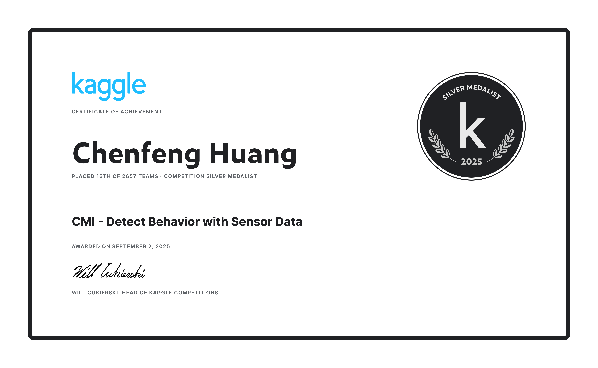

## Child Mind Institute — Detect Behavior with Sensor Data (CMI‑DBSD) Solution


This solution was developed for the Kaggle competition [Child Mind Institute — Detect Behavior with Sensor Data](https://www.kaggle.com/competitions/cmi-detect-behavior-with-sensor-data), where participants classify wrist‑worn multimodal sensor sequences into fine‑grained gesture classes relevant to BFRB‑like behaviors. The approach engineers IMU orientation‑aware features, aggregates ToF/thermopile signals, and trains a two‑branch temporal CNN with a modality gate and metric learning. A subject‑level global assignment post‑processing improves class diversity across sequences.

Our work earned a Silver Medal. The repository contains end‑to‑end training and an inference server compatible with Kaggle’s evaluation API. 🥈



## Competition Overview

### Competition Introduction

The goal is to predict the gesture class for each sequence recorded by a Helios wrist device with multimodal sensors:
- IMU (accelerometer, quaternion orientation) at high frequency
- Thermopile (THM) temperature sensors
- Time‑of‑Flight (ToF) distance sensors (5 modules × 64 pixels)

The official evaluation is a hierarchical macro‑averaged F1, implemented here as an equal‑weight average of:
- Binary F1: target (BFRB‑like) vs non‑target
- Multiclass macro F1: target classes kept separate; all non‑target merged to `non_target`

### Competition Background

Detecting BFRB‑like behaviors from wrist sensors requires robust orientation handling, denoising, and cross‑modal fusion. A practical pipeline must:
- Align across left/right handedness
- Derive linear acceleration and angular kinematics from quaternions
- Summarize high‑dimensional ToF pixels safely (handle no‑return values)
- Train sequence models without subject leakage and optimize temporal receptive fields

## Solution Overview

This solution comprises four components:

1. **Feature Engineering**
   - Remove gravity from `acc_[x,y,z]` using quaternion `rot_[x,y,z,w]` to get linear acceleration.
   - Derive angular velocity and angular distance from quaternion sequences.
   - Aggregate ToF per sensor (`mean,std,min,max` over 64 pixels with `-1 → NaN` handling) and include raw THM.

2. **Two‑Branch CNN with Modality Gate**
   - IMU branch splits into acceleration‑related and rotation‑related sub‑branches with residual SE‑CNN blocks.
   - ToF/THM branch uses residual SE‑CNN; a learned scalar gate down‑weights noisy ToF/THM.
   - Fused backbone → global pooling → dense head for classification; also returns a 128‑d embedding.

3. **Training Protocol**
   - StratifiedGroupKFold (n=5) stratified by `sequence_type`, grouped by `subject` to prevent leakage.
   - Loss: soft cross‑entropy + triplet margin loss (hard mining) + gate supervision via BCE (randomly masked ToF/THM in collate).
   - Cosine LR with warmup; best‑per‑fold checkpoints saved.

4. **Inference with Global Assignment**
   - Average logits across 5 fold models; compute log‑probs per sequence.
   - For each subject, apply the Hungarian algorithm on the (sequences × classes) log‑prob matrix to promote unique‑class assignments across that subject’s sequences.

The final output per sequence is a fine‑grained gesture label.


## How to Reproduce

### Environment Setup

- Python 3.10+ recommended
- Install dependencies:

```bash
pip install -r requirements.txt
```


### Data Layout

Place the competition CSVs under `data/`:

```
data/
├─ train.csv
├─ test.csv
├─ train_demographics.csv
└─ test_demographics.csv
```

Notes:
- Time‑series columns include IMU (`acc_*`, `rot_*` quaternions), THM (`thm_*`), and ToF pixels (`tof_[1..5]_v0..v63`).
- `-1` in ToF pixels denotes no‑return; handled as `NaN` before aggregation.

### Training

Run end‑to‑end training with 5‑fold CV and artefact export:

```bash
python train.py
```

Outputs are saved to `artifacts/`:
- `scaler.pkl`, `sequence_maxlen.npy`, `feature_cols.npy`, `gesture_classes.npy`
- `gesture_two_branch_fold{0..4}.pth`

### Inference

- Kaggle submission workflow (recommended):
  - Upload `artifacts/` as a Kaggle Dataset (e.g., `cmi-dbsd-models`).
  - In a Kaggle Notebook, attach that dataset; run `inference.py` to serve via the provided gateway.
- Local smoke test:
  - `inference.py` is built for Kaggle mounts (`/kaggle/input/...`). For local runs, adapt paths or replicate Kaggle’s input layout.

## Files and Structure

- `train.py`: Training pipeline, feature engineering, CV, and model saving
- `inference.py`: Artefact loading, per‑sequence prediction, subject‑level assignment, Kaggle gateway
- `model.py`: Two‑branch temporal CNN with SE blocks and ToF gate
- `dataset.py`: Dataset/augmentations, padding/collate with ToF masking
- `helpers.py`: Quaternion‑aware feature utilities and padding
- `metric.py`: Official hierarchical F1 implementation used for monitoring
- `artifacts/`: Saved scaler, feature metadata, class list, and fold checkpoints

## Data Source and Citation

- See `data/data_source.md` and the Kaggle competition page for rules and data access.

```bibtex
@misc{cmi-detect-behavior-with-sensor-data,
    author = {Laura Newman, David LoBue, Arianna Zuanazzi, Florian Rupprecht, Luke Mears, Roxanne McAdams, Erin Brown, Yanyi Wang, Camilla Strauss, Arno Klein, Lauren Hendrix, Maki Koyama, Josh To, Curt White, Yuki Kotani, Michelle Freund, Michael Milham, Gregory Kiar, Martyna Plomecka, Sohier Dane, and Maggie Demkin},
    title = {CMI - Detect Behavior with Sensor Data},
    year = {2025},
    howpublished = {\url{https://kaggle.com/competitions/cmi-detect-behavior-with-sensor-data}},
    note = {Kaggle}
}
```

## Author

Maintainer: Chenfeng Huang — [Kaggle](https://www.kaggle.com/alrickh)

For questions, please open an issue or discussion in this repository.

## License

Distributed under the terms of the license in `LICENSE`.
